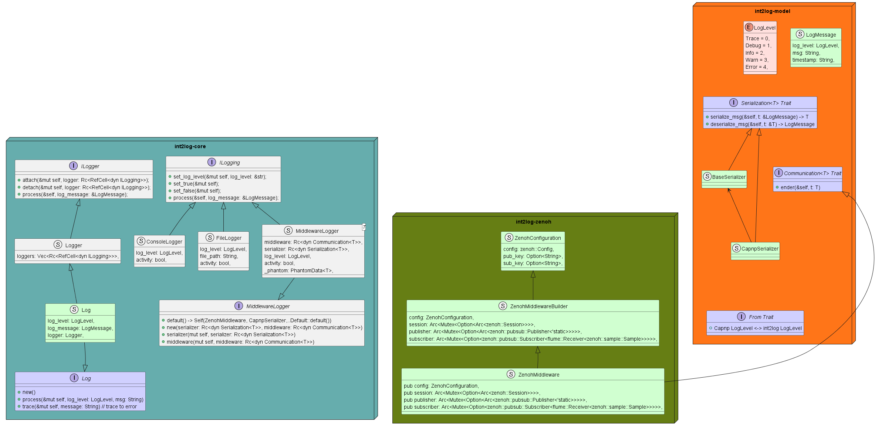

# Int2Log

 

본 리포지토리는 인텔렉투스 로깅 유틸리티 개발을 위한 레포지토리입니다.

## :file_folder: Contents
* [Documents](./docs/) : 문서(설계 자료, 참고 논문 등)
    + [Rules](./docs/rules/) : 개발 관련 그라운드 룰
        - [Git 사용 방안](./docs/rules/git.md) : Git 사용 관련 권고 사항 정리
    + [Build](./docs/build.md): 빌드 및 설치 안내
* [Source](./src/) : 개발 산출물
    - [Core](./src/core) : 코어 로직
    - [Clients](./src/clients) : 언어별 Wrapper 
    - [Tools](./tools) : 각종 툴
* [Tools](./tools/) : 개발 및 운영 도구
* [Docker](./docker/) : 생성 컨테이너 관리

## :pencil: License

This project is licensed under [GPL-3.0](./LICENSE) license.

## :🔨: Architecture

https://www.notion.so/intellectuscorp/Int2Log-System-bf6e9eb70916461d954db3c69d257d72?pvs=4
