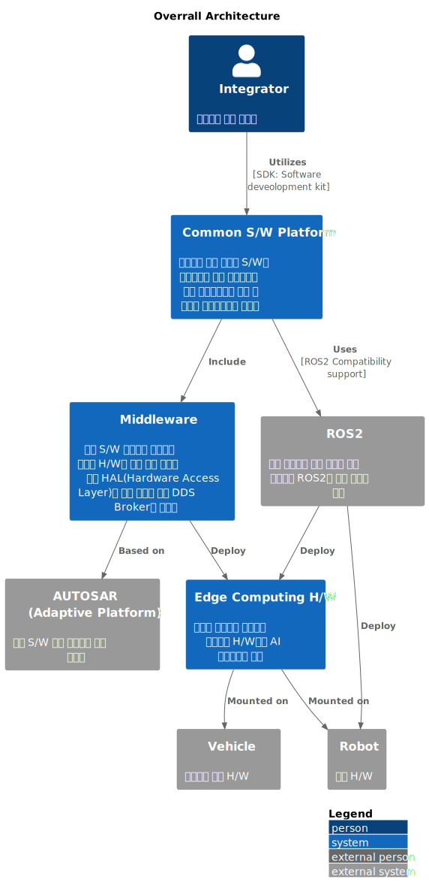
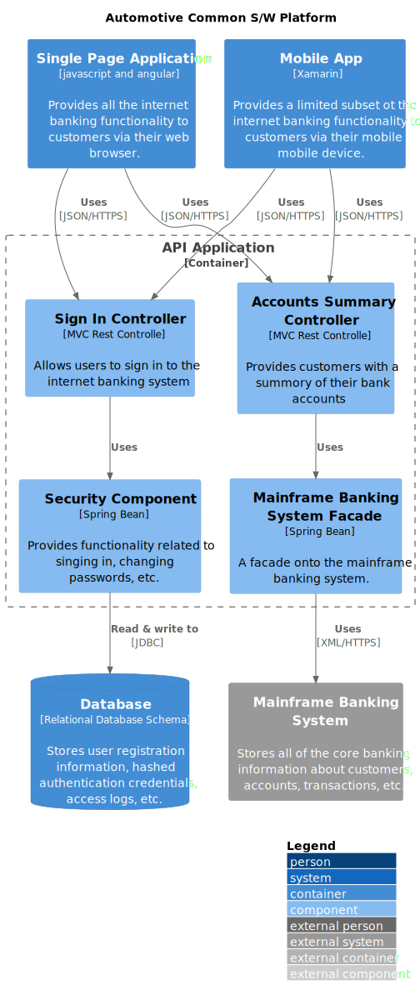
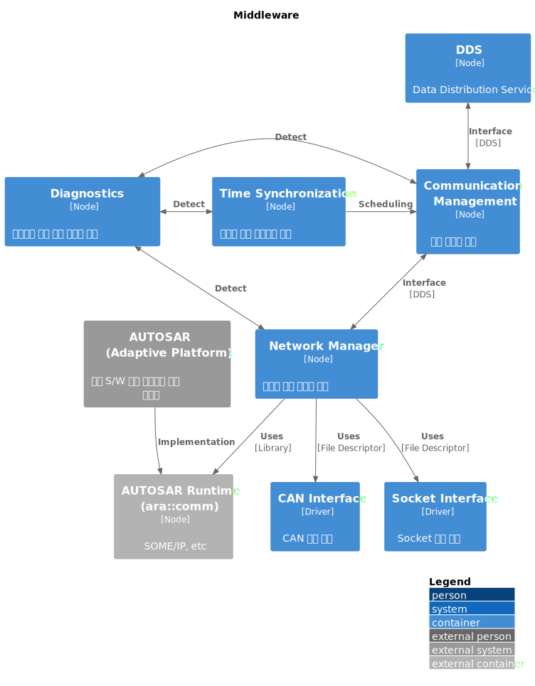

## HLD

### Introduction

모든 산출물에 대한 설계는 C4 모델을 적용하여 진행합니다. 

C4 모델은 소프트웨어 시스템의 구조를 시각화하고 문서화하는데 사용되는 방법론입니다. 이 모델은 "Context", "Containers", "Components", "Code"의 네 가지 수준으로 구성되며, 각 수준은 시스템의 다른 추상화 단계를 대표합니다. C4 모델은 시스템을 이해하고 설계 결정을 문서화하는데 있어 명확한 구조를 제공하며, 개발자, 설계자, 이해관계자 간의 의사소통을 향상시키는데 도움을 줍니다.

- Context (컨텍스트): 시스템이 운영되는 환경과 주변 시스템, 사람들(이해관계자)과의 관계를 보여줍니다. 이 단계는 전체 시스템의 경계와 외부 인터페이스를 정의합니다.

- Containers (컨테이너): 시스템을 구성하는 고수준의 소프트웨어 구성요소(웹 애플리케이션, 데이터베이스, 파일 시스템 등)와 그 관계를 설명합니다. 각 컨테이너는 실행 가능한 어플리케이션이나 데이터 저장소로 생각할 수 있습니다.

- Components (컴포넌트): 각 컨테이너 내부의 구조를 보다 세부적으로 나누며, 시스템의 주요 구성요소와 그 사이의 상호작용을 보여줍니다. 컴포넌트 단계는 설계의 핵심 부분을 이해하는데 중요합니다.

- Code (코드): 컴포넌트 수준의 세부 사항으로, 실제 코드 단위(클래스, 함수 등)의 구조를 나타냅니다. 이 단계는 개발자에게 가장 관련이 깊습니다.

C4 모델을 사용함으로써, 복잡한 시스템의 구조를 명확하게 이해하고, 다양한 관점에서 시스템을 바라볼 수 있습니다. 이 모델은 시스템의 다양한 측면을 층별로 분해하여, 각 이해관계자가 관심 있는 부분에 집중할 수 있게 해줍니다. 설계 초기 단계에서부터 유지보수 단계에 이르기까지, C4 모델은 시스템의 이해도를 높이고 효과적인 의사소통을 촉진하는 강력한 도구로 작용합니다

### 1. Overrall Architecture (Context)

### 2. Common S/W Platform (Container)

### 3. Middleware (Container)

